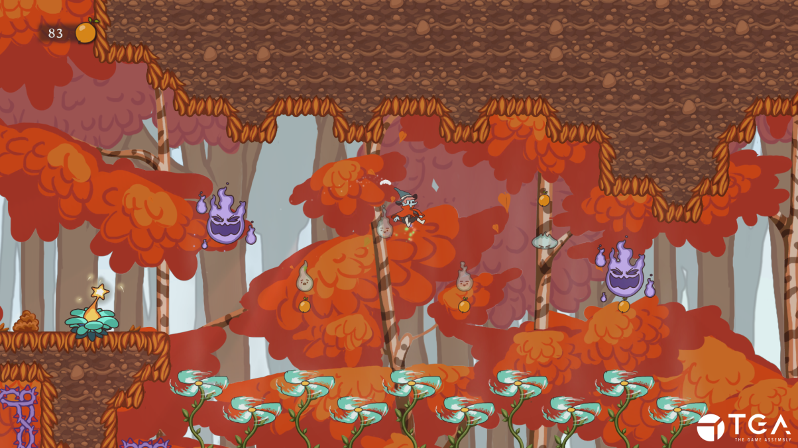
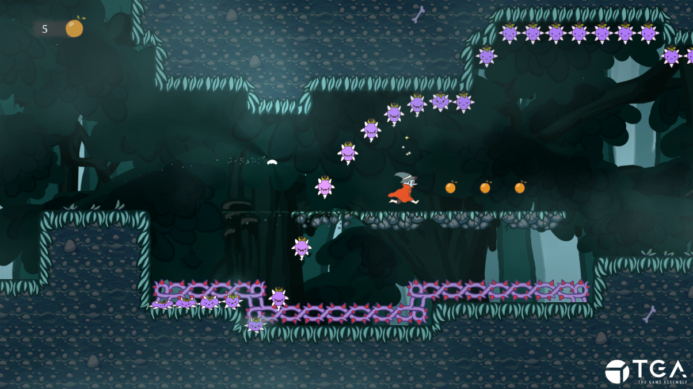

## Trailer
<iframe src='https://www.youtube.com/embed/yERRZnzvhoU' frameborder='0' allowfullscreen></iframe>

## Details

- 2D Sidescrolling Platformer
- 8 Weeks Part-Time
- Made in C++ with TGA2D
- Nominated for the [Swedish Game Awards](https://www.gameawards.se/Games/2019/Filur) in three categories (Game of the Year, Best Art and Best Design)
- Downloadable [here](https://sniglarnaigaraget.itch.io/filur)

## Contributions
- **Camera System** - Essentially a centralized system to find out where an object was on screen in relation to the camera. 
- **Parallax Backgrounds** - The scrolling backgrounds, where the math part of calculating a 2D position based on a certain depth was implemented into the camera. 
- **Crumbling Blocks** - A gameplay element where if the player stands on a certain block, it starts to crumble and eventually disappear. 
- **Updrafts** - Tiles where the player would be pushed upwards from wind. 
- **"Audio Manager"** - Essentially an audio pipeline interfaced with a .json file, where other disciplines can define which audio files should be available in the game. 
- **"3D" Particles** - Added a "depth" parameter to particles that takes advantage from the parallax math functions implemented into the camera, which also scales the size of the particles based on their depth. 
- **Screenspace Godrays** - Implemented a godray shader based on [this article](https://developer.nvidia.com/gpugems/gpugems3/part-ii-light-and-shadows/chapter-13-volumetric-light-scattering-post-process).

## Screenshots

