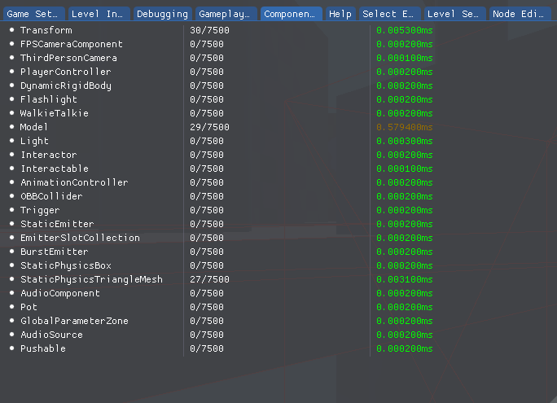
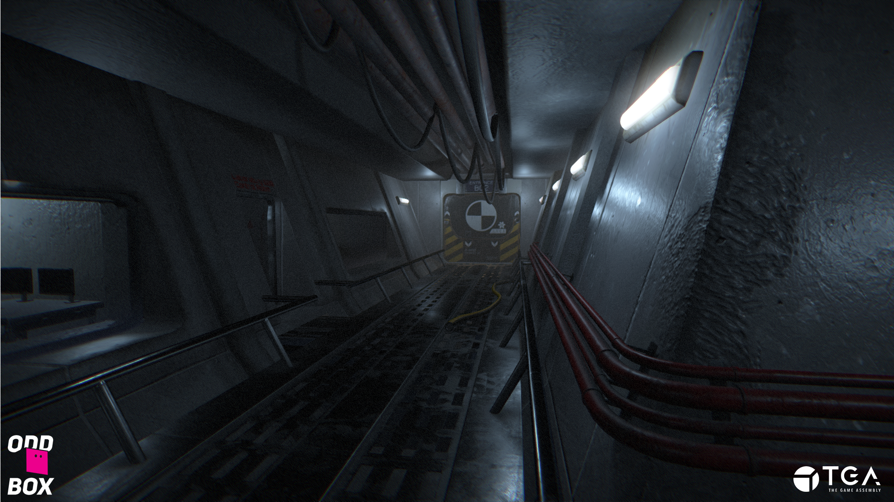

## Trailer

<iframe src='https://www.youtube.com/embed/tDxg2ky3iww' frameborder='0' allowfullscreen></iframe>

## Details
- 3D Space Shooter
- 10 Weeks Part-Time
- Made in our own DirectX11 based C++ engine

## Contributions
- **Rewrote the Component System** - I rewrote the component system so that components are registered compile-time. This allowed me to attach a component to a GameObject with just an ID, or a string without knowing the component type. This was a vital step to have completely seemless .json based GameObject blueprints, which describes which components the GameObject in question has. Because of this, other desciplines have the power to create new types of GameObjects completely without any extra work from the programmers side. More info [here](https://www.andreaswinthersorman.com/Component-System/).

- **Rewrote the Particle Editor** - I spent a lot amount of time to rewrite the particle editor based on our technical artists requests and feedback.

- **Component Performance Profiler** - A tool for measuring each components performance in milliseconds, integrated in to the component system itself. The data of the performance is presented as such:

The milliseconds represents the amount of time it took running through _all active_ components of one type. The colour of the text gets increasingly red depending on how high the value is.

- **Post-Process Pipeline** - A pipeline made for our technical artists so that they can add their own post-processing shaders to the game without the help of a programmer.

- **Updated the Particle System** - Added a rotation parameter for our particles, which rotates the particle's billboard sprite. Also implemented something called "soft-particles" based on [this article](http://blog.wolfire.com/2010/04/Soft-Particles), which is a method to get rid of sharp edges that appears when the particle quad collides with world geometry. The method includes changing the alpha of the relevant pixels based on the particles depth, and the scene depth buffer. The difference between those two determines the final alpha value for that pixel. 

- **Depth of Field Shader** - An shader where I blurred pixels at certain depths in relation to where the player looks. The player's look-at depth is sampled at the center of a blurred depth buffer, which creates smooth blur transitions between drastic camera movements.

## Screenshots

