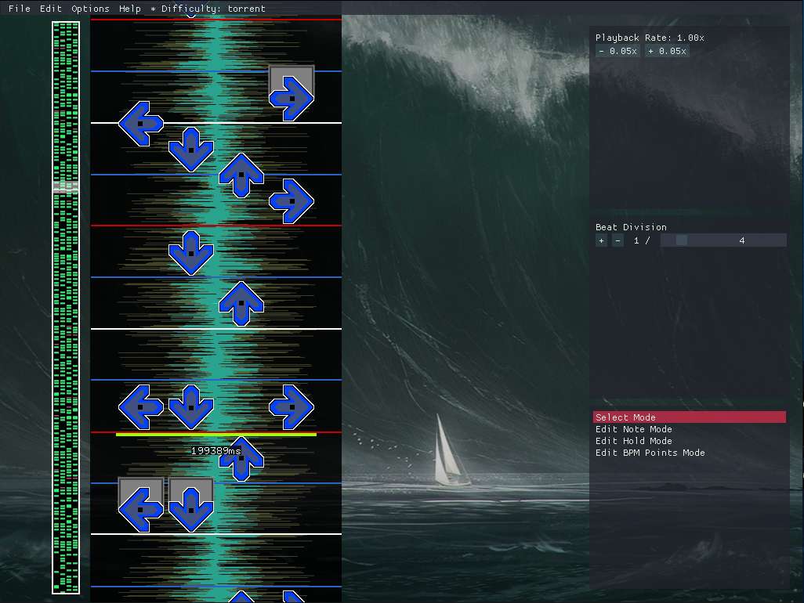
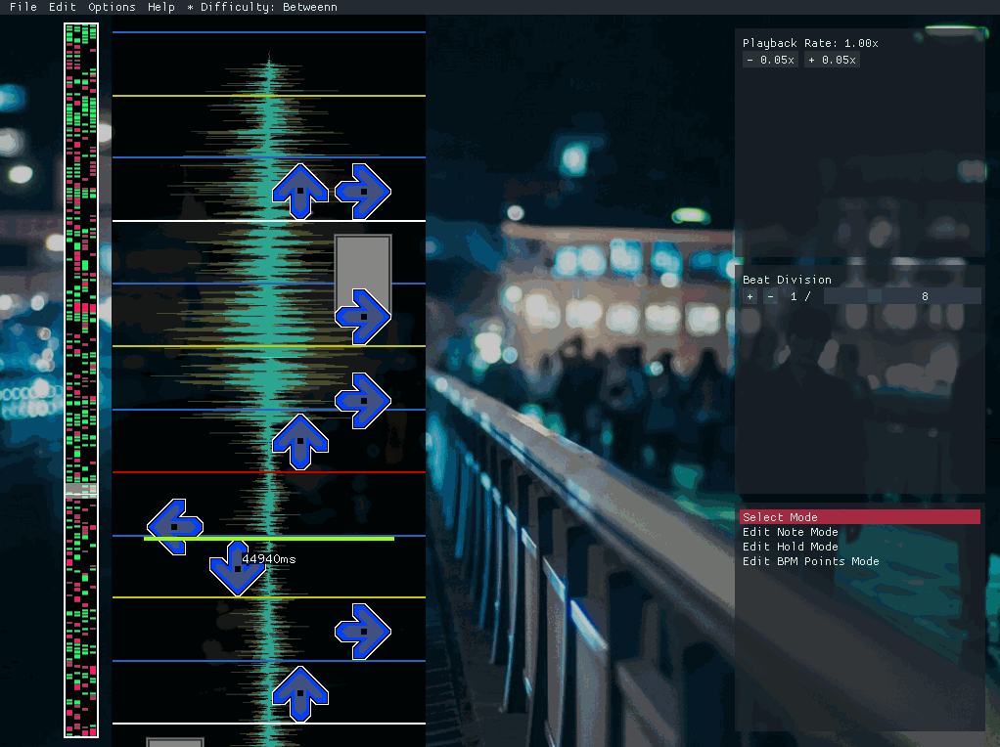
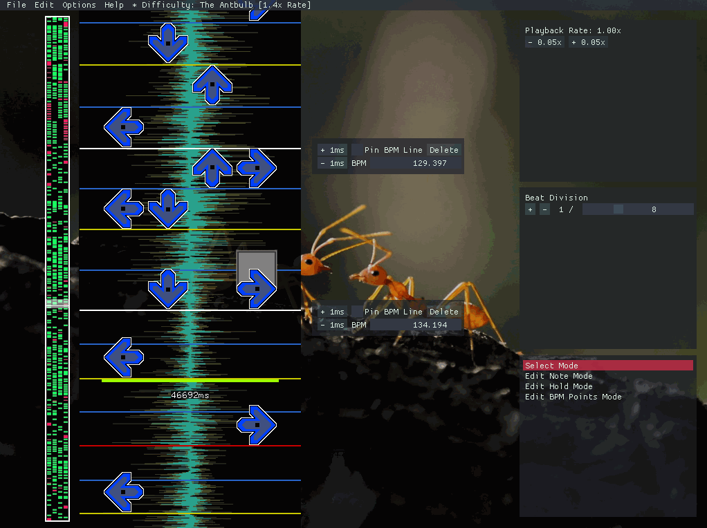

# An editor for osu!mania

## Screenshot


## Details:
- 5 Weeks Part-Time
- Written in Visual C++ within openFrameworks, with the ImGui and BASS library
- Had prepared a small engine for parsing beatmaps and rendering them before the start of the specialization course

In this post I will bring up some of the more interesting and niche problems I encountered while developing Encore that you otherwise normally wouldn't encounter developing tools and editors for other types of games.  

## Goal and Purpose
The goal of my specialization course at The Game Assembly was to write an editor for a game called [osu!](https://osu.ppy.sh/), and for a specific gamemode within that game called [osu!mania](https://osu.ppy.sh/help/wiki/Game_Modes/osu!mania). The purpose of this project was to get more experience writing a tool for a specific game, while encountering new and unique problems along the way. 

## Content
- [What is osu!mania?](#what-is-osu!mania?)
- [Motivation](#motivation)
- [Rendering notes that are on screen from a big collection](#rendering-notes-that-are-on-screen-from-a-big-collection)
- [About note placement](#about-note-placement)
- [Rendering the waveform efficiently](#rendering-the-waveform-efficiently)
- [Conclusion](#conclusion)
- [Feature Showcase](#feature-showcase)
- [Resources](#resources)


## What is osu!mania?
osu!mania is a so called "Vertically Scrolling Rhythm Game" (VSRG), which is loosely based on games such as Guitar Hero, Dance Dance Revolution and IIDX. The point of the game, is to press buttons to their respective columns, where notes fly downwards (or upwards depending on the game) to the rhythm of the song. Score is given based on how well you time your button presses with the notes positioning in relation to the "hit receptor", more info [here](https://osu.ppy.sh/help/wiki/Game_Modes/osu!mania). Those files that describes the levels layout to the song are called "beatmaps".


## Motivation
The current official editor for creating these beatmaps is already solid as it is, but still lacks some significant features due to it not being updated for years. An example of this would be the amount of beat divisions supported. Currently, the official editor only supports 1/2, 1/3, 1/4, 1/6, 1/8, 1/12 and 1/16 beat divisions, which is not enough considering that some songs uses uneven beat divisions such as 1/5 and/or 1/7. Other features that the current editor lacks are features such as "freeform" note placement (allows you to place the note at any milliesecond in the timeline, for more freeform type of songs), a visual waveform of the song, and changing the songs pitch in realtime which allows you to listen to the songs details more closely. 

Lastly, I'm personally a map creator, so creating maps with my own tool allows me to constantly improve, develop and iterate the editor with new features that also could serve other map creators alike, who also serve as a great source of feedback which helps me to further my experience in creating specialized tools. 


## Rendering notes that are on screen from a big collection
As the title suggests, the problem here is rendering notes that are on screen from a big collection, while still maintaining the ability to scroll through the entire beatmap dynamically. First, we need to declare how a "note" is defined. A note is defined by a timepoint which represents where the note is in the song in milliseconds (the format that osu! is using), and a column, which describes which column the note's in. 
```cpp
struct NoteData
{
	int timePoint = 0;
	int column = 0;	
  
	bool selected = false;
	bool hasMoved = false;
};
```
In this case, I represent a note as a struct since I find it more convenient to let data be data, which also serves as a preperation for binary saving/loading of beatmaps in the future. 

The naive way of doing this would be to iterate over every note in the beatmap, and check which ones are on screen and then render them. The issue with this approach is that the performance is bound to the size of the beatmap in question, which could be described as a O(n) complexity. In this case, we wan't something close to a O(1) complexity, since you should ideally be able to create beatmaps based on all types of songs, which includes longer ones. 

The solution to this is to essentially keep the notes in their collection sorted after their `timePoint`, and keep track of an index of where the screen's first visible note is. Everytime the user decides to scroll in in the timeline, the index gets updated in relation to it's last value. 
```cpp
for (unsigned int noteIndex = myLastObjectIndex; noteIndex < myObjectData->size(); noteIndex++)
{
	double noteTimePoint = GetScreenTimePoint((*myObjectData)[noteIndex]->timePoint, aTimePoint);

	//render all visible notes
	if (noteTimePoint >= 0)
	{
		myLastObjectIndex = noteIndex;
		myVisibleObjects.clear();

		if (noteIndex > 0)
		{
			T* itemBack = (*myObjectData)[noteIndex - 1];
			myVisibleObjects.push_back(itemBack);
		}

		for (unsigned int visibleNoteIndex = noteIndex; visibleNoteIndex < myObjectData->size(); visibleNoteIndex++)
		{
			double visibleNoteTimePoint = GetScreenTimePoint((*myObjectData)[visibleNoteIndex]->timePoint, aTimePoint);

			if (visibleNoteTimePoint <= ofGetScreenHeight())
			{
				T* item = (*myObjectData)[visibleNoteIndex];

				item->visibleTimePoint = visibleNoteTimePoint;
				DrawRoutine(item, visibleNoteTimePoint);
					
				myVisibleObjects.push_back(item);
			}
			else
			{
				T* itemFront = (*myObjectData)[visibleNoteIndex];
				myVisibleObjects.push_back(itemFront);

				break;
			}
		}
		break;
	}
}
```
`myLastObjectIndex` is the index of the first visible note, `GetScreenTimePoint` is used to translate the notes timepoint to a visual point on screen in relation to where the user is in the timeline. As soon as `noteTimePoint` bigger than 0, it means that the first note is visible on screen. From that on I iterate from the current note index, render all those notes and as soon as one of the note's visual timepoint is bigger than the screen height, I break the for loop. This only works if the note collection is sorted after their timepoints. But as a result, the rendering performance of the notes is not limited to their collection size, but rather how many notes there currently are on screen. The only place where I can see it being a bit iffy performance wise is when the user jumps in the timeline. But as it turns out that is not really an issue, since it only needs to recalculate `myLastObjectIndex` once per jump. 


## About note placement
With note rendering in place, I was worried about the next potential performance hog. Since the note collection needs to be sorted at all times, inserting a new note means that I would push back the new note into the collection, and sort it. With `std::sort` this is surprisingly fast. Why? Well, looking at the Visual C++ implementation for `std::sort`, we can see that it uses a combination of quick sort, heap sort and insertion sort for different cases. All of these cover most cases, including if the collection is mostly sorted, which it is in my case. 

Although it works well in Visual C++, this would have to be revisited if I ever decide to port it over to another platform such as Linux, or even Mac, since entirely different compilers would have to be used, which could potentially have a different implementation of std::sort.


## Rendering the waveform efficiently 
Something that many users of the official osu!mania editor have been missing, is a waveform. A waveform is useful for all kinds of things, such as visually pointing out where sounds starts and ends, which helps a great deal with timing your beatmaps. To draw the waveform, I need first and foremost the audio data. To ensure the best compatability with osu, I used the audio library [BASS](https://www.un4seen.com/), which is a commonly used C library for playing audio. BASS does have a few low level functions for situations just like these. So through the documentation I found `BASS_ChannelGetData()`, which returns a pointer to the audio data. 
```cpp
mySongByteLength = BASS_ChannelGetLength(decoder, BASS_POS_BYTE);
myWaveFormData = (float*)std::malloc(mySongByteLength);
BASS_ChannelGetData(decoder, myWaveFormData, mySongByteLength);
```
Every first float in the data represents the right ear channel, and every second represents the left ear channel. The first iteration of the waveform was drawn with individual lines, which was of course pretty expensive.

Instead of drawing individual lines of the waveform every frame, I used [ofFbo](https://openframeworks.cc/documentation/gl/ofFbo/)'s to pre-render the waveform into "slices", and saved them in a std::vector. This way, I could figure out which slice to render based on the current time, and only render the visible slices on screen. 
```cpp
for (int t = 0; t < songLengthMS; t += myWaveFormSliceSize)
{
	ofFbo* surface = new ofFbo();
	surface->allocate(256, myWaveFormSliceSize);
	surface->begin();
	ofClear(255, 255, 255, 0);
	bool first = true;
	int time = -1;
	for (int y = 0; y < myWaveFormSliceSize; y += 1)
	{
		int visualY = y;
		visualY -= (EditorConfig::hitLinePosition);
		int timePointMS = visualY + t;
		if (first == true)
		{
			time = timePointMS;
			first = false;
		}
		if (timePointMS <= BASS_ChannelBytes2Seconds(myStreamHandle, mySongByteLength) * 1000 && timePointMS >= 0)
		{
			size_t index = BASS_ChannelSeconds2Bytes(myStreamHandle, double(timePointMS) / 1000.0) / 2;
			if (index < mySongByteLength / sizeof(float))
			{
				float width1 = abs(myWaveFormData[index]);
				float width2 = abs(myWaveFormData[index + 1]);
				ofSetColor(255, 255, 0, 128);
				ofDrawLine(128, myWaveFormSliceSize - y, 128 + width2 * 128.f, myWaveFormSliceSize - y);
				ofSetColor(255, 255, 0, 128);
				ofDrawLine(128, myWaveFormSliceSize - y, 128 - width1 * 128.f, myWaveFormSliceSize - y);
				ofSetColor(0, 255, 255, 192);
				ofDrawLine(128, myWaveFormSliceSize - y, 128 + width2 * 64.f, myWaveFormSliceSize - y);
				ofSetColor(0, 255, 255, 192);
				ofDrawLine(128, myWaveFormSliceSize - y, 128 - width1 * 64.f, myWaveFormSliceSize - y);
				ofSetColor(255, 255, 255, 255);
			}
		}
	}
	surface->end();
	myWaveFormStructure.push_back({ surface, time });
}
```
For rendering, it was as easy as finding the index of several screenpoints with `(timePointMS / myWaveFormSliceSize)`, and rendering those slices with that index. 
```cpp
for (int y = ofGetWindowHeight(); y >= -ofGetWindowHeight() * 2; y -= scaledSliceSize)
{
	int visulY = y;
	
	//find where visulY (a point on screen) is in the song in milliseconds
	visulY -= EditorConfig::hitLinePosition;
	visulY = int(float(visulY) / EditorConfig::scale);
	
	int timePointMS = visulY + int((myCurrentTime * 1000.0) + 0.5);
	
	int index = (timePointMS / myWaveFormSliceSize);
	if (index >= 0 && index < myWaveFormStructure.size())
	{
		DrawWaveFormSliceAtIndex(index);
	}
}
```
`DrawWaveFormSliceAtIndex` is used to draw the slices based various editor parameters.

## Conclusion
I'm happy with how Encore turned out, as it is my current editor of choice when creating beatmaps. I learnt a lot of interesting things from developing it. Developing a tool for an actual game that others could use was a useful experience, since I encountered problems such as compatability, adhering to file formats, and specific niche issues that's almost exlusive to the game in question. Developing a tool doesn't require any general knowledge, but rather requires you to study what you're developing the tool for closely because of those niche issues. 

## Feature Showcase

How you place notes and holds alike, and removing them.



If you copy a selection and paste it, you will get a preview of the paste and allowed to place it where ever you like.


Showing how you can navigate the beatmap, and that zooming in and out is possible. 



This is how you edit BPM points, which are used for snapping notes and holds to the beat.


All keymodes from 1 key to 16 keys are supported.


## Resources
- [Encore](https://github.com/VortexCoyote/Encore)
- [osu!](http://osu.ppy.sh/)
- [osu!mania](https://osu.ppy.sh/help/wiki/Game_Modes/osu!mania)
- [.osu fileformat documentation](https://osu.ppy.sh/help/wiki/osu!_File_Formats/Osu_(file_format))
- [openFrameworks](https://openframeworks.cc/)
- [Dear ImGui](https://github.com/ocornut/imgui)
