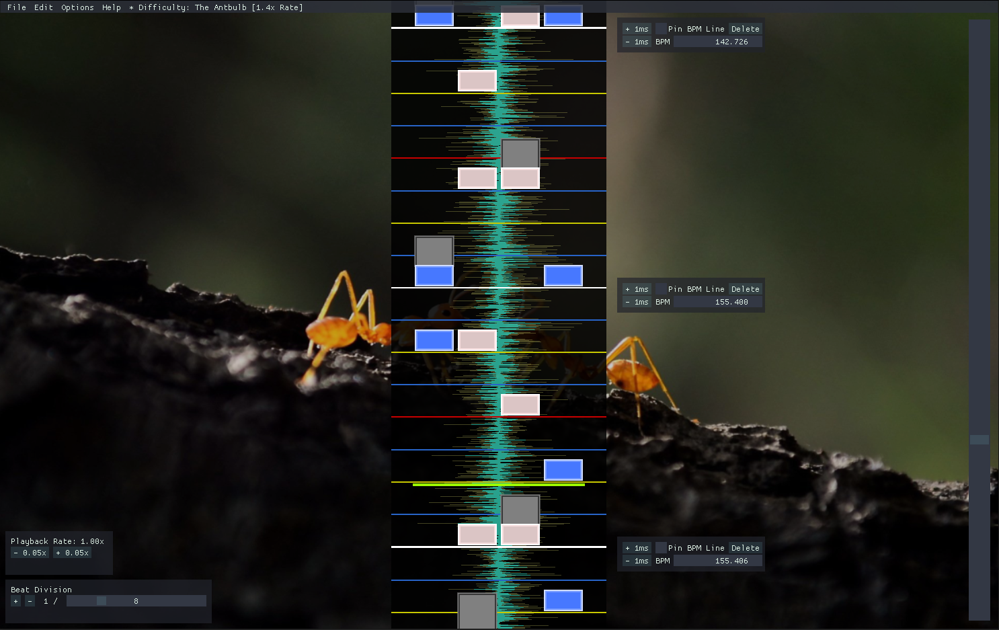

# An editor for osu!mania

## Screenshot


## Details:
- 5 Weeks Half-Time
- Written in Visual C++ within openframeworks, with the ImGui and BASS library
- Had prepared a small engine for parsing beatmaps and rendering them before the start of the specialization course

## Goal and Purpose
The goal of my specialization course at The Game Assembly write an editor to a game called [osu!](https://osu.ppy.sh/), and for a specific gamemode within that game called [osu!mania](https://osu.ppy.sh/help/wiki/Game_Modes/osu!mania). The purpose of this project was to get more experience writing a tool for a specific game, while encountering new and unique problems along the way. 

## Contents
- [What is osu!mania?](#what-is-osu!mania?)


## What is osu!mania?
osu!mania is a so called "Vertically Scrolling Rhythm Game" (VSRG), which is loosely based on games such as Dance Dance Revolution, IIDX and Guitar Hero. The point of the game, is to press buttons to their respective columns, where notes fly downwards (or upwards depending on the game) to the rhythm of the song. Score is given based on how well you time your button presses with the notes positioning in relation to the "hit receptor", more info [here](https://osu.ppy.sh/help/wiki/Game_Modes/osu!mania). Those files that describes the levels layout to the song are called "beatmaps".

## The fileformat

## Rendering notes that are on screen from a big collection
As the title suggests, the problem here is rendering notes that are on screen from a big collection, while still maintaining the ability to scroll through the entire beatmap dynamically. First, we need to declare how a "note" is defined. A note is defined by a timepoint which represents where the note is in the song in milliseconds (the format that osu! is using), and a column, which describes which column the note's in. 
```cpp
struct TimeFieldObject
{
	int timePoint = 0;
	float visibleTimePoint = -1.f;
};

struct NoteData : public TimeFieldObject
{
	int column = 0;	
  
	bool selected = false;
	bool hasMoved = false;
};
```
In code, a note is purely data and thus is declared as a struct with public members. I've also made bass struct called `TimeFieldObject` which is used as a base for all types that's represented on the timefield, such as beatlines for instance. Keep in mind that I've removed some variables for the sake of keeping it simple and focused. 

The naive way of doing this would be to iterate over every note in the beatmap, and check which ones are on screen and then render them. The issue with this approach is that the performance is bound to the size of the beatmap in question, which could be described as a O(n) complexity. In this case, we wan't something close to a O(1) complexity, since you should ideally be able to create beatmaps based on all types of songs, which includes longer ones. 

The solution to this is to essentially keep the notes in their collection sorted after their `timePoint`, and keep track of an index of where the screen's first visible note is. Everytime the user decides to scroll in in the timeline, the index gets updated in relation to it's last value. 
```cpp
for (unsigned int noteIndex = myLastObjectIndex; noteIndex < myObjectData->size(); noteIndex++)
{
	double noteTimePoint = GetScreenTimePoint((*myObjectData)[noteIndex]->timePoint, aTimePoint);

	//render all visible notes
	if (noteTimePoint >= 0)
	{
		myLastObjectIndex = noteIndex;
		myVisibleObjects.clear();

		if (noteIndex > 0)
		{
			T* itemBack = (*myObjectData)[noteIndex - 1];
			myVisibleObjects.push_back(itemBack);
		}

		for (unsigned int visibleNoteIndex = noteIndex; visibleNoteIndex < myObjectData->size(); visibleNoteIndex++)
		{
			double visibleNoteTimePoint = GetScreenTimePoint((*myObjectData)[visibleNoteIndex]->timePoint, aTimePoint);

			if (visibleNoteTimePoint <= ofGetScreenHeight())
			{
				T* item = (*myObjectData)[visibleNoteIndex];

				item->visibleTimePoint = visibleNoteTimePoint;
				DrawRoutine(item, visibleNoteTimePoint);
					
				myVisibleObjects.push_back(item);
			}
			else
			{
				T* itemFront = (*myObjectData)[visibleNoteIndex];
				myVisibleObjects.push_back(itemFront);

				break;
			}
		}
		break;
	}
}
```
`myLastObjectIndex` is the index of the first visible note, `GetScreenTimePoint` is used to translate the notes timepoint to a visual point on screen in relation to where the user is in the timeline. As soon as `noteTimePoint` bigger than 0, it means that the first note is visible on screen. From that on I iterate from the current note index, render all those notes and as soon as one of the note's visual timepoint is bigger than the screen height, I break the for loop. This only works if the note collection is sorted after their timepoints. But as a result, the rendering performance of the notes is not limited to their collection size, but rather how many notes there currently are on screen. The only place where I can see it being a bit iffy performance wise is when the user jumps in the timeline. But as it turns out that is not really an issue, since it only needs to recalculate `myLastObjectIndex` once per jump. 

## About note placement
With note rendering in place, I was worried about the next potential performance hog. Since the note collection needs to be sorted at all times, inserting a new note means that I would push back the new note into the collection, and sort it. With `std::sort` this is surprisingly fast. Why? Well, looking at the Visual C++ implementation for `std::sort`, we can see that it uses a combination of quick sort, heap sort and insertion sort for different cases. These all cover most cases, including if the collection is mostly sorted, which it is in my case.


## Rendering the waveform efficiently 
## The Editing and placement of "BPM Points"

## Resources
